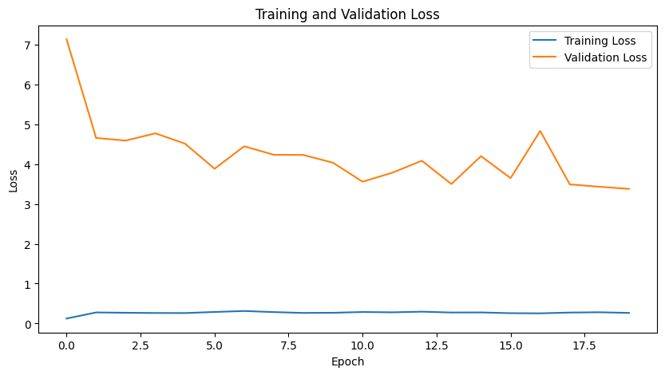
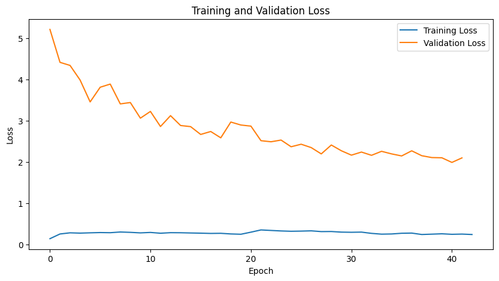
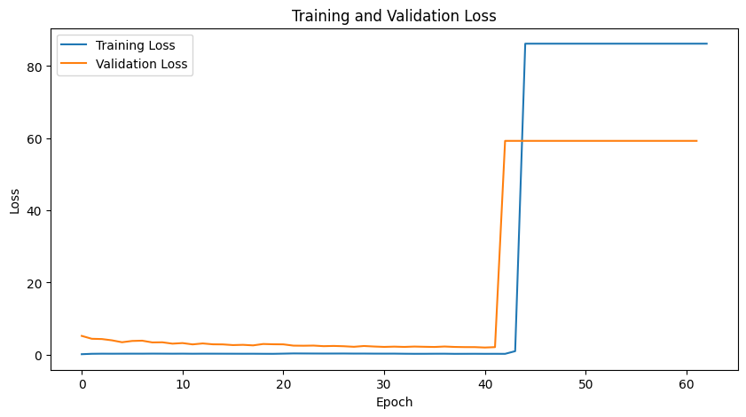
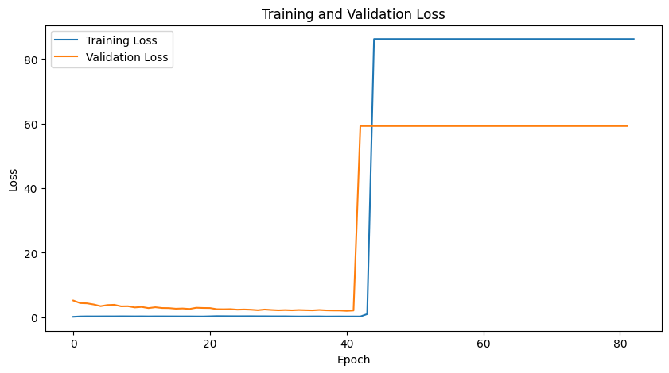
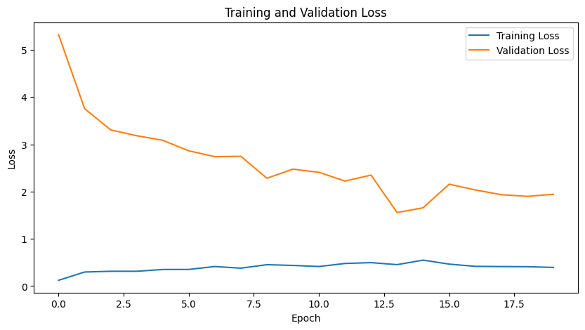

# Multiple Instance Learning for Digital Pathology Analysis

## Project Overview

This project implements Multiple Instance Learning (MIL) techniques for analyzing whole slide images (WSIs) in digital pathology. The system processes high-resolution pathology images by dividing them into smaller patches (instances) and learning from bag-level labels (tumor/normal).

### Note
The dataset in this folder is not complete but is a lighter version intended for testing and experimentation.

## Key Features

- **MIL Dataset Handling**: Custom PyTorch dataset for WSIs and patches
- **Two MIL Approaches**:
  - Instance-level MIL with max-pooling aggregation
  - Attention-based MIL with learnable weights
- **Training Variations**: Multiple configurations tested (see Results)
- **Imbalanced Data Handling**: Weighted loss functions implemented

## Installation

```bash
git clone [repository-url]
cd Multiple-Instance-Learning-for-Digital-Pathology-Analysis
pip install -r requirements.txt
```

- Each WSI folder (e.g., `bag00001`) represents a bag containing multiple patches (instances).
- `labels.csv` contains bag-level labels (0: normal, 1: tumor).

## Implementation

### Key Components
1. **MILDataset Class**: A PyTorch `Dataset` class to handle the data structure.
   - Loads patches for each WSI.
   - Applies optional transforms to each patch.
   - Returns a tensor of patches and the bag-level label.

2. **Collate Function**: Custom `collate_fn` for the DataLoader to handle variable-sized bags.
   - Pads smaller bags with zeros to match the largest bag in the batch.
   - Returns masks to identify padded elements.

3. **MIL Model**:
   - **Instance Encoder**: A CNN to extract 256-dimensional features from each patch.
   - **Classifier**: An MLP to predict instance-level scores.
   - **Aggregation**: Max-pooling to aggregate instance scores into a bag-level prediction.

4. **Training and Evaluation**:
   - Implements `train_epoch` and `evaluate` functions.
   - Uses weighted Binary Cross-Entropy Loss to handle class imbalance.
   - Tracks metrics (accuracy, precision, recall, F1-score).

# Model Evaluation and Analysis

## Strengths of the Design

- **Appropriate Model Architecture**: The choice of a **CNN-based instance encoder** (`InstanceEncoder`) is suitable for this task since we are dealing with image data. The **classifier** (`Classifier`), a multi-layer perceptron (MLP) with ReLU activation, provides the flexibility to learn non-linear relationships.
  
- **Max-Pooling Aggregation**: The decision to employ **max-pooling** aligns well with the instance-level MIL approach, assuming that a bag is positive if at least one of its instances is positive. Max-pooling captures the most salient instance-level score.

- **Addressing Data Imbalance**: After recognizing the dataset's imbalance, a weighted loss function was used to mitigate its effects. Ignoring imbalance can result in biased models favoring the majority class.

- **Suitable Loss Function and Optimizer**: The use of **Binary Cross-Entropy Loss** (BCELoss) quantified the difference between predicted probabilities and true labels. Combining this with the weighted strategy made it an appropriate choice for handling the imbalanced data. The **Adam optimizer** was chosen for this task.

---

## Rationale for Parameter Choices

- **Learning Rate**: Initially set to \(10^{-6}\), adjustments to \(10^{-4}\) were made to test its influence on performance. This empirical tuning strategy is reasonable, as the learning rate significantly affects convergence and overall performance.
  
- **Model Size and Architecture**: The architecture was kept relatively simple to prevent overfitting in the context of limited data.

- **Data Splitting**: Splitting the dataset into training and validation sets ensured unbiased evaluation of the model's generalization ability. The training set optimized the model's parameters, while the validation set provided feedback on performance.
  
- **Number of Epochs**: Running the model for 20 epochs allowed sufficient iterations to learn the data. Early stopping could be implemented in the future since we observed that the validation converges quickly.

---

## Results and Analysis

### Initial Results with Standard BCE Loss

- **Training Metrics**:
  - **Loss**: 0.2654
  - **Accuracy**: 91.34%
  - **Precision**: 89.60%
  - **Recall**: 89.09%
  - **F1**: 89.34%

- **Validation Metrics**:
  - **Loss**: 3.3771
  - **Accuracy**: 40.74%
  - **Precision**: 40.74%
  - **Recall**: 100.00%
  - **F1**: 57.89%

### Results with Weighted BCE Loss

- **Training Metrics**:
  - **Loss**: 0.2375
  - **Accuracy**: 93.24%
  - **Precision**: 91.61%
  - **Recall**: 91.82%
  - **F1**: 91.71%
  
- **Validation Metrics**:
  - **Loss**: 2.0950
  - **Accuracy**: 50.74%
  - **Precision**: 45.19%
  - **Recall**: 98.18%
  - **F1**: 61.89%

The **weighted BCE Loss** improved both training and validation metrics, particularly accuracy and F1-score, while slightly reducing recall.

### Results with Learning Rate \(10^{-4}\)

- **Training Metrics**:
  - **Loss**: 86.1953
  - **Accuracy**: 40.74%
  - **Precision**: 40.74%
  - **Recall**: 100.00%
  - **F1**: 57.89%
  
- **Validation Metrics**:
  - **Loss**: 59.2593
  - **Accuracy**: 40.74%
  - **Precision**: 40.74%
  - **Recall**: 100.00%
  - **F1**: 57.89%

Changing the learning rate worsened results significantly, suggesting the model's sensitivity to this parameter is limited and that further tuning may not yield significant improvements.

---

## Final Analysis

The model demonstrates **perfect recall (100.00%)**, crucial in medical applications where missing positive cases could lead to undiagnosed conditions or delayed treatments. However, the **low precision (40.74%)** indicates a high rate of false positives, which could lead to overdiagnosis and unnecessary procedures, straining medical resources. The overall **accuracy (40.74%)** is poor. The **F1-score (57.89%)** reflects the model's focus on recall at the cost of precision.

## Conclusion

While high recall is a desirable outcome in medical applications, the model's low precision and modest F1-score suggest it is not robust enough for clinical deployment. Improvements are needed, including better handling of larger and more diverse datasets, and more complex models.

---

## Attention Implementation

### Analysis of Attention Implementation

This implementation incorporates an Attention-based Multiple Instance Learning (Attention-MIL) model instead of the previously used Max-Pooling-based MIL. This change aims to address the limitations observed in the earlier approach, particularly its inability to balance precision and recall effectively, as well as its suboptimal handling of class imbalance.

### Justification of the New Implementation

- **Attention Mechanism**: The attention-based MIL model addresses the oversimplification of Max-Pooling by considering all instances in the bag and assigning them learnable importance weights. This is critical for medical datasets, where multiple patches may contribute to a diagnosis.

- **Improved Instance Encoder**: The addition of dropout tries to prevent overfitting, which was an issue in the previous implementation. A smaller embedding size (128 vs. 256) is more efficient and better suited for the attention layer.

- **Weighted Loss**: Retaining the weighted BCE Loss ensures that the model accounts for class imbalance.

- **Learning Rate**: A learning rate of \(10^{-4}\) was chosen.

Despite implementing the model using an attention mechanism, the metrics, especially those from the validation phase, remain suspicious as they do not change across epochs. This could indicate a potential error in the code implementation that has not been identified. Nevertheless, the loss values achieved are lower than those obtained in the previous approach.

Several potential solutions were explored to address this task, but the results achieved are not ideal, indicating that the model may be overfitting, as reflected in the validation metrics.
---

## Some plots
## Training Plots

### 1. Training Metrics with Normal BCE Loss
- **Title**: Loss and Accuracy Over Epochs (Learning Rate = \(10^{-6}\), Instance Encoder: InstanceEncoder, Aggregation: MaxPool, Criterion: Normal BCE Loss)
- **Description**: This plot shows the loss and accuracy metrics during the training phase for the model using a learning rate of \(10^{-6}\). The `InstanceEncoder` with max-pooling aggregation is utilized, demonstrating how the model's performance evolves over 20 epochs.
- **Image**: 

### 2. Training Metrics with Weighted BCE Loss
- **Title**: Loss and Accuracy Over Epochs (Learning Rate = \(10^{-6}\), Instance Encoder: InstanceEncoder, Aggregation: MaxPool, Criterion: Weighted BCE Loss)
- **Description**: This plot illustrates the loss and accuracy metrics during the training phase for the model using a learning rate of \(10^{-6}\) with a weighted BCE loss function. It highlights the impact of addressing class imbalance on the model's performance over 20 epochs.
- **Image**: 

### 3. Training Metrics with Weighted BCE Loss (Higher Learning Rate)
- **Title**: Loss and Accuracy Over Epochs (Learning Rate = \(10^{-4}\), Instance Encoder: InstanceEncoder, Aggregation: MaxPool, Criterion: Weighted BCE Loss)
- **Description**: This plot presents the loss and accuracy metrics during the training phase for the model using a learning rate of \(10^{-4}\) and a weighted BCE loss function. It captures the model's performance dynamics across 20 epochs, showcasing how a higher learning rate influences training.
- **Image**: 

### 4. Training Metrics with Weighted BCE Loss (Lower Learning Rate)
- **Title**: Loss and Accuracy Over Epochs (Learning Rate = \(10^{-8}\), Instance Encoder: InstanceEncoder, Aggregation: MaxPool, Criterion: Weighted BCE Loss)
- **Description**: This plot depicts the loss and accuracy metrics during the training phase for the model using a learning rate of \(10^{-8}\) with a weighted BCE loss function. It analyzes the effects of a significantly lower learning rate on the training process over 20 epochs.
- **Image**: 

### 5. Training Metrics with Attention Implementation
- **Title**: Loss and Accuracy Over Epochs (Learning Rate = \(10^{-4}\), Instance Encoder: Attention-Based, Criterion: Weighted BCE Loss)
- **Description**: This plot showcases the loss and accuracy metrics during the training phase for the model utilizing an attention-based instance encoder with a learning rate of \(10^{-4}\) and a weighted BCE loss function. It highlights the performance of the model across 20 epochs and the advantages of the attention mechanism in addressing instance importance.
- **Image**: 
